# Laravel Alumni Association Management Sysytem
# Including
- Installation System
- Login System
- Setting System
- User Management
- Role And permission System
- Create Local Language

# Installation and use

## Dependency
- PHP >= 7.1.3
- OpenSSL PHP Extension
- PDO PHP Extension
- Mbstring PHP Extension
- Tokenizer PHP Extension
- XML PHP Extension
- Ctype PHP Extension
- JSON PHP Extension

```
$ git clone  git@github.com:RaselEmran/Laravel-Role-Permission-Language-and-installation-system.git
$ cp .env.example .env
$ composer install
$ php artisan serve
```
Now visit and login: http://localhost:8000 \

# Screenshot

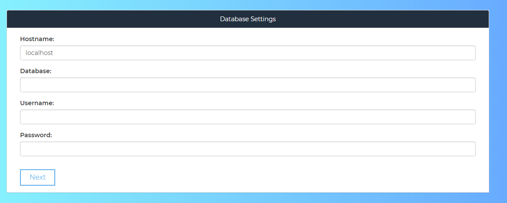
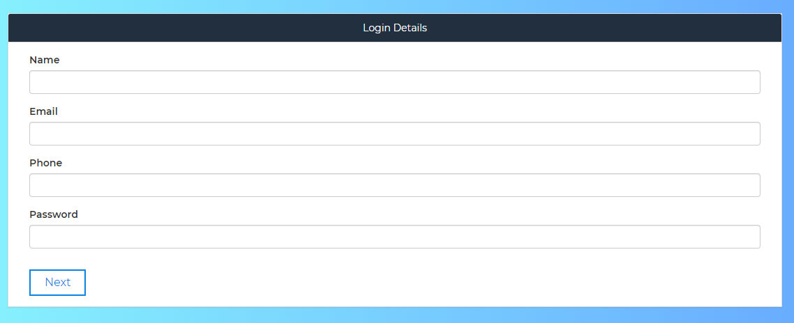
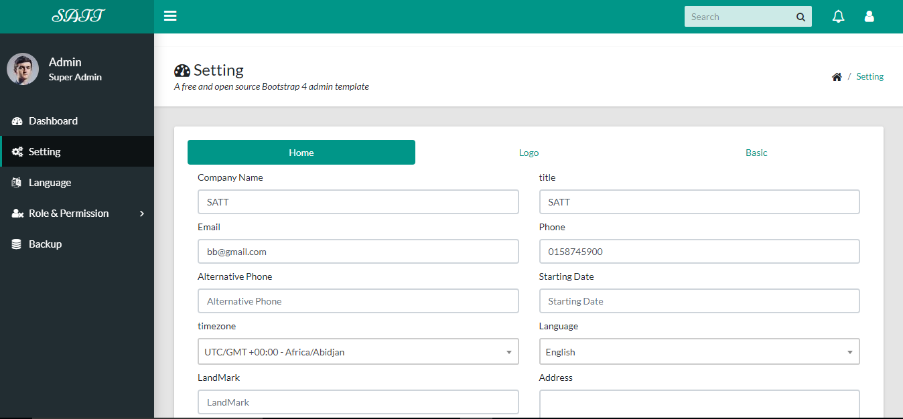
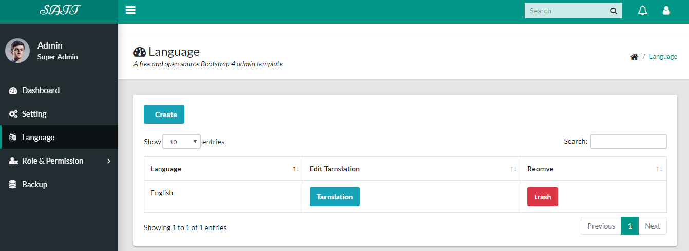
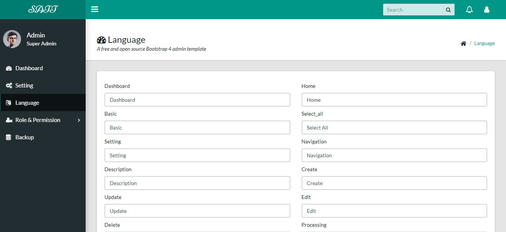
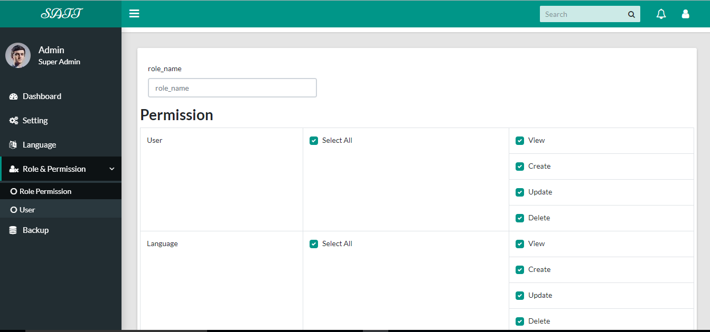
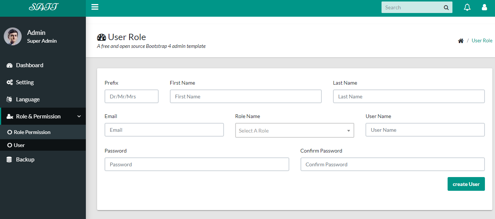
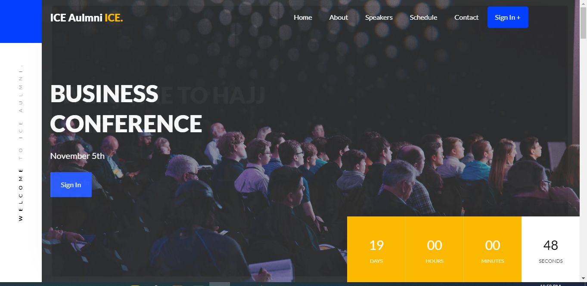

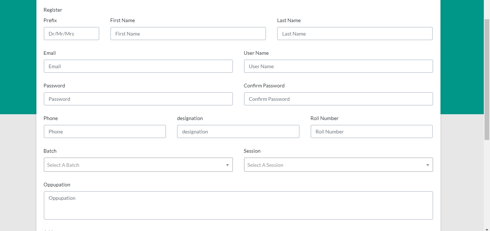
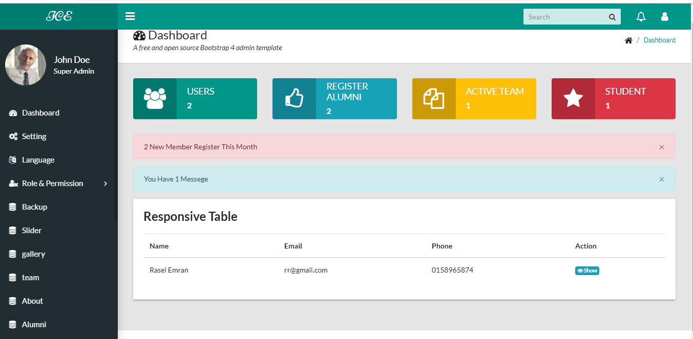
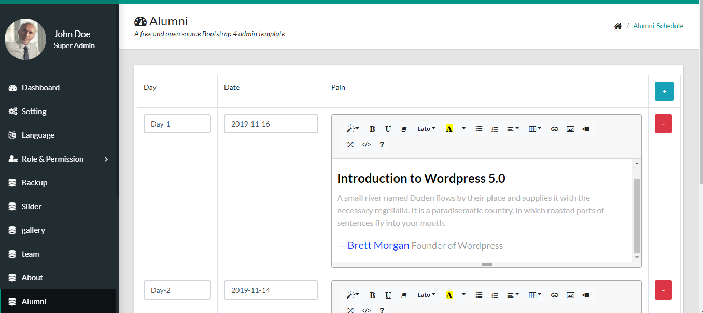
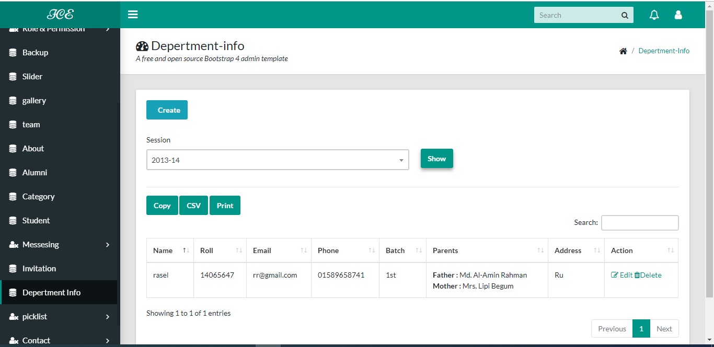


# License

This is open-sourced software licensed under the AGPL-3.0 license. Frameworks and libraries has it own licensed

#Contact
Email: alamranice47ru@gmail.com
Facebook: https://www.facebook.com/amran.alamran.5